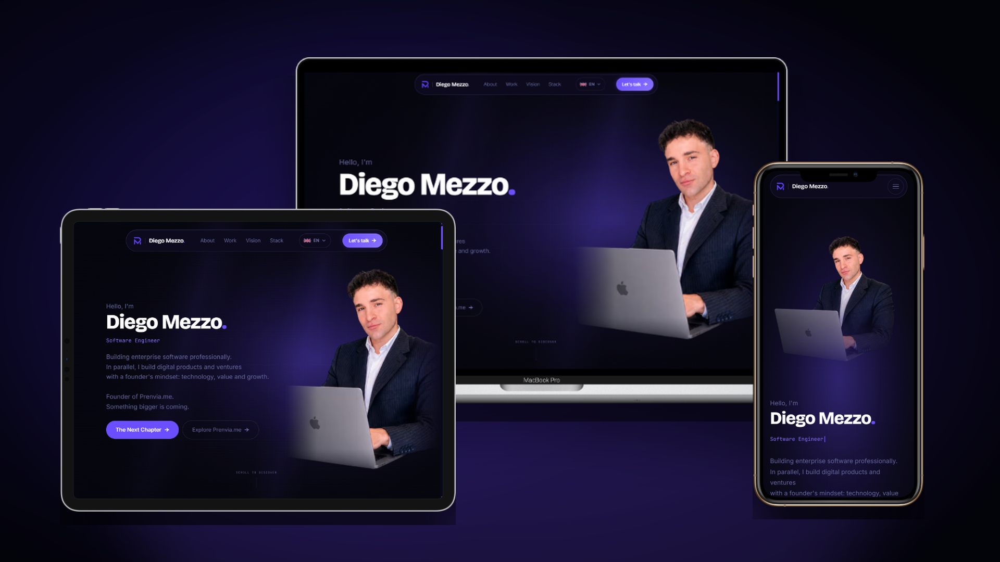

<p align="center">
  <a href="README.md">
    
  </a>
  <a href="README.it.md">
    
  </a>
</p>

<h1 align="center">diegomezzo.com</h1>

<p align="center">
  <strong>Portfolio personale e sito di identità digitale</strong>
</p>

<p align="center">
  Portfolio premium pensato per raccontare la mia identità professionale, il mio percorso da Software Engineer, la visione da founder e i prodotti digitali che sto costruendo.
</p>

<p align="center">
  🌐 <a href="https://diegomezzo.com">Sito Online</a> •
  🧠 Sviluppo guidato dall’AI •
  🎨 Identità visiva premium •
  ⚡ Esperienza web statica
</p>

<p align="center">
  
  
  
  
  
</p>

---

## Screenshot

<p align="center">
  
</p>

---

## Nota sul Repository

Questo repository pubblico non contiene il codice sorgente di diegomezzo.com.

Il sito completo viene sviluppato, mantenuto e aggiornato all’interno di un repository privato.

Questo repository nasce esclusivamente come showcase pubblico del progetto e include documentazione, screenshot e informazioni tecniche di alto livello.

---

## Panoramica

diegomezzo.com è il mio portfolio personale e sito di identità digitale.

Il progetto nasce con un obiettivo preciso: presentare chi sono come Software Engineer, founder e builder attraverso un’esperienza web statica, premium e curata nei dettagli.

Il sito racconta il mio background professionale, l’esperienza ingegneristica, il percorso da founder, i prodotti digitali e i canali di contatto attraverso una visual identity dark, moderna e riconoscibile.

Non è stato pensato come un semplice curriculum online.

diegomezzo.com è una piattaforma di personal brand: uno spazio digitale dove credibilità tecnica, visione di prodotto e identità professionale si incontrano in un’unica esperienza coerente.

Il progetto rappresenta sia il mio percorso attuale, sia la direzione verso cui sto costruendo: creare prodotti software, esperienze digitali e soluzioni business con solide fondamenta tecniche.

---

## Funzionalità Principali

* Portfolio personale premium
* Sito web statico e responsive
* Esperienza utente basata su animazioni e micro-interazioni
* Animazioni sviluppate con GSAP
* Transizioni parallax nella Hero e nella sezione About
* Immagini responsive ottimizzate
* Metadata SEO-oriented
* Open Graph e social preview configurati
* Identità visiva dark, elegante e professionale
* Sezione dedicata all’esperienza professionale
* Storytelling sul percorso da founder
* Sezione prodotti digitali
* Contatti e link professionali
* Architettura statica orientata alle performance

---

## Stack Tecnologico

### Frontend

* HTML5
* CSS3
* JavaScript
* GSAP
* ScrollTrigger

### Design & User Experience

* Responsive Web Design
* Motion Design
* Visual Identity
* UI/UX Design
* Markup orientato all’accessibilità
* Metadata SEO
* Metadata Open Graph

### Asset & Ottimizzazione

* Immagini ottimizzate
* Formati responsive
* Asset WebP / AVIF
* Favicons e social preview
* Ottimizzazione degli asset statici

### Infrastruttura

* Hosting statico
* Cloudflare
* Dominio personalizzato
* Gestione DNS e cache

---

## Architettura

```text
Visitatore
   │
   ▼
Sito Statico
   │
   ├── Struttura HTML
   ├── Sistema visivo CSS
   ├── Interazioni JavaScript
   ├── Motion layer con GSAP
   └── Asset ottimizzati
            │
            ▼
      Cloudflare / Hosting
```

### Architettura del Sito

diegomezzo.com segue un’architettura statica progettata per garantire velocità, semplicità e pieno controllo sul risultato finale.

Il sito è costruito intorno a un frontend custom, dove struttura, layout, identità visiva, comportamento responsive e animazioni vengono gestiti direttamente tramite HTML, CSS e JavaScript.

Il progetto non utilizza CMS o framework frontend pesanti.

Questa scelta permette di mantenere il sito leggero, performante e completamente modellato sull’esperienza di personal brand che volevo ottenere.

L’architettura è stata pensata attorno a:

* Rendering statico delle pagine
* Sistemi di layout responsive
* Distribuzione ottimizzata dei media
* Sezioni arricchite da motion design
* Metadata SEO e social
* Workflow di deploy semplice e controllato
* Coerenza visiva su desktop, tablet e mobile

---

## Percorso di Sviluppo

Il progetto è stato sviluppato attraverso diverse fasi:

1. Definizione del posizionamento personale
2. Costruzione della visual identity
3. Pianificazione della struttura e dei contenuti
4. Ideazione della Hero e dello storytelling principale
5. Sviluppo dei layout responsive
6. Implementazione delle animazioni con GSAP
7. Ottimizzazione delle immagini e generazione degli asset
8. Setup SEO, metadata e social preview
9. Test cross-device e rifinitura dell’esperienza
10. Deploy, gestione cache e validazione in produzione

---

## Perché Questo Progetto Conta

diegomezzo.com è stato creato per essere molto più di un portfolio.

È la base digitale della mia identità professionale: un punto di riferimento dove la mia esperienza da Software Engineer, il percorso da founder di Prenvia.me e la mia visione a lungo termine vengono presentati in modo chiaro, curato e credibile.

Questo progetto mi ha permesso di lavorare a fondo su frontend craft, responsive design, motion, visual storytelling, performance, SEO e posizionamento personale.

In un mercato pieno di portfolio generici, l’obiettivo era creare qualcosa che sembrasse intenzionale, premium e personale.

Un sito capace di comunicare non solo cosa faccio, ma anche il livello di attenzione, cura e precisione che porto nella costruzione di prodotti digitali.

diegomezzo.com rappresenta la mia presenza professionale, il mio mindset ingegneristico e l’ambizione di continuare a costruire prodotti, brand ed esperienze software con valore reale.

---

## Stato Attuale

diegomezzo.com è attualmente online:

👉 https://diegomezzo.com

Il sito è pienamente operativo e continuerà a evolversi insieme al mio percorso professionale, ai miei prodotti e alla mia presenza digitale.

In questa fase, la struttura principale del portfolio, l’identità visiva, il comportamento responsive e i contenuti core sono stati implementati e rifiniti.

Le evoluzioni future potranno includere case study più dettagliati, pagine progetto dedicate, contenuti tecnici, sezioni legate ai servizi e integrazioni più profonde con il mio ecosistema di prodotti digitali.

---

## Autore

**Diego Mezzo**

Software Engineer
Founder di Prenvia.me
Studente di Ingegneria Informatica

🌐 [Website](https://diegomezzo.com)
💼 [LinkedIn](https://www.linkedin.com/in/diego-mezzo-748094270)
📧 [Email](mailto:contact@diegomezzo.com)
